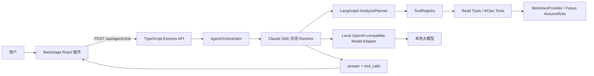
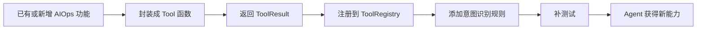

# AIOps agent 项目文件

## 项目定位

AIOps agent 是一套面向 Backstage + TypeScript + React AIOps 平台的统一 Agent 服务，核心编排采用 LangGraph.js。

目标是把原 AIOps 平台已有能力，以及后续新增能力，统一接入一个聊天式 Agent 入口。Agent 的工具选择优先由本地 OpenAI-compatible 大模型根据 Tool Manifest 进行语义规划，LangGraph 负责校验、流转和执行。

```text
POST /api/agent/chat
```

用户只需要和 Agent 对话，Agent 负责识别意图、选择工具、汇总证据、调用本地大模型分析，并在需要交付时进入受控变更流程。

## 当前技术栈

```text
语言：TypeScript
后端：Node.js + Express
Agent 编排：LangGraph.js
前端宿主：Backstage + React
Schema：Zod
测试：Vitest
模型接口：本地 OpenAI-compatible /v1/chat/completions
AWS：当前为模拟账号，后续可替换成真实 AssumeRole 只读查询
```

## 总体架构



## 核心模块

```text
src/app/              Express 应用和 HTTP 路由
src/agent/            Agent 编排、Claude SDK 形态运行时、本地模型适配器
src/tools/            只读工具、工具注册表、只读 Guard
src/delivery/         变更计划、审批、执行、审计、幂等保护
src/integrations/aws/ 模拟 AWS Provider，后续接真实 AWS
src/schemas/          请求校验和响应类型
src/tests/            单元和接口测试
```

## 已实现能力

### 只读查询与分析

```text
query_alerts                  告警查询
query_service_cost            费用查询
query_cluster_status          EKS 集群状态
query_resource_inventory      资源库存
query_logs                    日志查询
query_incident_diagnosis      跨域故障诊断
query_cost_anomalies          成本异常分析
query_runbook_recommendations Runbook 建议
query_aiops_summary           AIOps 总览
```

### 交付与变更工作流

```text
POST /api/delivery/changes              创建变更计划
GET  /api/delivery/changes/:id          查看变更计划
POST /api/delivery/changes/:id/approve  审批变更
POST /api/delivery/changes/:id/execute  执行变更
GET  /api/delivery/changes/:id/audit    查看审计日志
```

当前执行器是 mock，不会修改真实基础设施。

### 用户身份、权限与对话管理

```text
Keycloak-compatible 身份解析
模块权限隔离
用户级 conversation 历史
多轮澄清
写操作转待审批 Delivery Change
```

## 扩展方式

后续把原 AIOps 平台功能接入 Agent，推荐走 Tool 方式：



统一工具返回结构：

```ts
type ToolResult = {
  tool: string;
  category: "Alert" | "FinOps" | "EKS" | "Resource" | "Log" | "AIOps";
  readonly: true;
  summary: string;
  data: Record<string, unknown>;
};
```

## 本地大模型连接方式

项目默认连接本地 OpenAI-compatible 接口：

```text
POST /v1/chat/completions
```

环境变量：

```bash
MODEL_PROVIDER=local
LOCAL_MODEL_BASE_URL=http://127.0.0.1:11434
LOCAL_MODEL_NAME=qwen2.5
LOCAL_MODEL_API_KEY=
```

适配对象可以是 Ollama、vLLM、LM Studio、LocalAI 或企业内部 OpenAI-compatible 网关。

## 安全原则

```text
1. 查询和诊断默认只读。
2. 写操作不进入 Tools，单独进入 Delivery Actions。
3. 交付动作必须有审批、RBAC、审计、幂等和回滚方案。
4. 大模型只负责理解、分析、生成建议，不直接绕过后端执行生产变更。
5. 生产环境变更需要更严格审批和变更窗口。
6. 用户身份和模块权限来自 Keycloak，上下文和工具执行按用户隔离。
7. 多轮对话必须绑定 conversation_id，不能跨用户读取历史。
```

## 当前仓库

```text
https://github.com/chunxili/aiops
```

## 本地运行

```bash
npm install
npm run dev
```

## 验证

```bash
npm run build
npm test
```
