# AWS Platform AIOps Agent

这是一个面向 AWS 平台运维场景的 AIOps Agent。项目采用 TypeScript + LangGraph.js，目标是兼容既有的 Backstage + TypeScript + React AIOps 平台，让原平台能力和后续扩展能力可以持续接入 Agent。

前端稳定入口只有一个：

```text
POST /api/agent/chat
```

当前版本默认连接本地 OpenAI-compatible 大模型接口，也可以切换到 MiniMax 或 mock 模型。AWS 账号由 `MockAwsProvider` 模拟。

## 总体架构

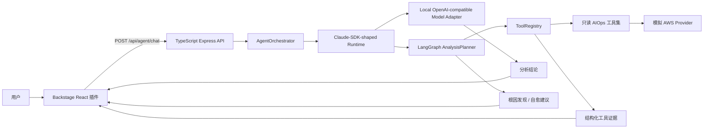

## 代码结构

```text
src/app/              Express 应用和 HTTP 路由
src/agent/            Agent Runtime、LangGraph 动态分析 Planner、本地 OpenAI-compatible 模型适配器
src/tools/            只读工具：AIOps、Alert、FinOps、EKS、Resource、Log
src/integrations/aws/ 模拟 AWS 账号 Provider，后续接 AssumeRole
src/schemas/          Zod 请求校验和 TypeScript 响应类型
src/tests/            API、工具、只读 Guard 测试
docs/                 架构和 Backstage 集成说明
```

## 运行方式

```bash
npm install
npm run dev
```

构建和生产方式运行：

```bash
npm run build
npm start
```

示例请求：

```bash
curl -X POST http://127.0.0.1:8000/api/agent/chat \
  -H "Content-Type: application/json" \
  -d '{"message":"查看本月费用、EKS 集群状态、日志、告警和 AIOps 总结"}'
```

## 环境变量

| 变量 | 是否必需 | 说明 |
| --- | --- | --- |
| `MODEL_PROVIDER` | 否 | 模型提供方：`local`、`minimax`、`mock`，默认 `local`。 |
| `LOCAL_MODEL_BASE_URL` | 否 | 本地 OpenAI-compatible API 地址，默认 `http://127.0.0.1:11434`。 |
| `LOCAL_MODEL_NAME` | 否 | 本地模型名，默认 `qwen2.5`。 |
| `LOCAL_MODEL_API_KEY` | 否 | 本地模型如果需要鉴权则配置；Ollama 等通常可留空。 |
| `MINIMAX_API_KEY` | 否 | 当 `MODEL_PROVIDER=minimax` 时使用。 |
| `MINIMAX_BASE_URL` | 否 | MiniMax API 地址，默认 `https://api.minimax.io`。 |
| `MINIMAX_MODEL` | 否 | MiniMax 模型名，默认 `MiniMax-M3`。 |
| `AWS_ROLE_ARN` | 否 | 后续真实 AWS AssumeRole 使用；当前 mock provider 不使用。 |
| `AWS_REGION` | 否 | AWS 区域，mock provider 默认 `us-east-1`。 |
| `PORT` | 否 | HTTP 端口，默认 `8000`。 |
| `SERVICE_CATALOG_SOURCE` | 否 | 服务目录来源：`mock`、`backstage`、`cmdb`，默认 `mock`。 |
| `BACKSTAGE_CATALOG_URL` | 否 | 当 `SERVICE_CATALOG_SOURCE=backstage` 时使用，例如 Backstage Catalog API 的 `/api/catalog` 地址。 |
| `CMDB_SERVICE_CATALOG_URL` | 否 | 当 `SERVICE_CATALOG_SOURCE=cmdb` 时使用，要求返回 `ServiceMetadata[]` 或 `{ "services": ServiceMetadata[] }`。 |

## Agent 调用链路

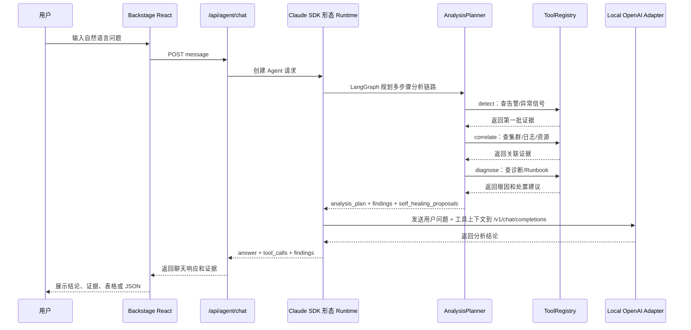

## 用户身份、权限与对话管理

当前版本已经实现 Keycloak-compatible 的第一阶段接入：Backstage 调用 Agent 时可以通过请求头传入用户身份、角色、组和模块权限。生产环境可以把这一层替换成真正的 Keycloak token 校验或 introspection。

本地模拟请求头：

```text
x-user-id: alice
x-user-name: alice
x-user-roles: sre,platform
x-user-groups: platform-team
x-module-permissions: Alert,EKS,Log,AIOps,Delivery
```

权限和会话隔离链路：

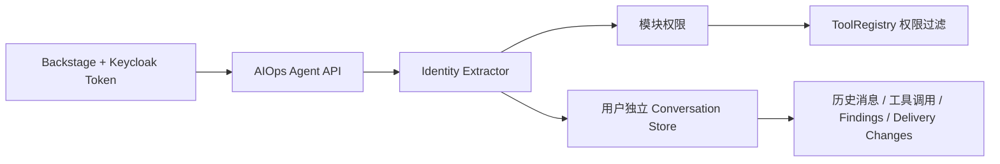

已实现会话接口：

```text
POST /api/agent/chat
GET  /api/agent/conversations
GET  /api/agent/conversations/:conversationId
```

行为约束：

- 每个用户只能访问自己的 `conversation_id`。
- `ToolRegistry` 会按 `x-module-permissions` 过滤用户可见工具。
- 没有模块权限的工具不会进入模型规划上下文，也不能被直接执行。
- 对话历史保存用户消息、Agent 回复、工具调用、findings 和交付变更引用。

## 多轮澄清与非只读变更

Agent 已经支持基础多轮澄清。遇到写操作但缺少目标对象时，不会直接执行，也不会立即创建变更，而是返回澄清问题。

示例：

```text
用户：帮我设置 WAF 黑名单
Agent：这个操作涉及变更。请补充目标对象，例如要加入 WAF 黑名单的 IP、服务名、环境，以及变更原因。
用户：IP 是 203.0.113.10，生产环境，原因是恶意扫描
Agent：生成待审批 WAF 黑名单变更计划
```

写操作处理规则：

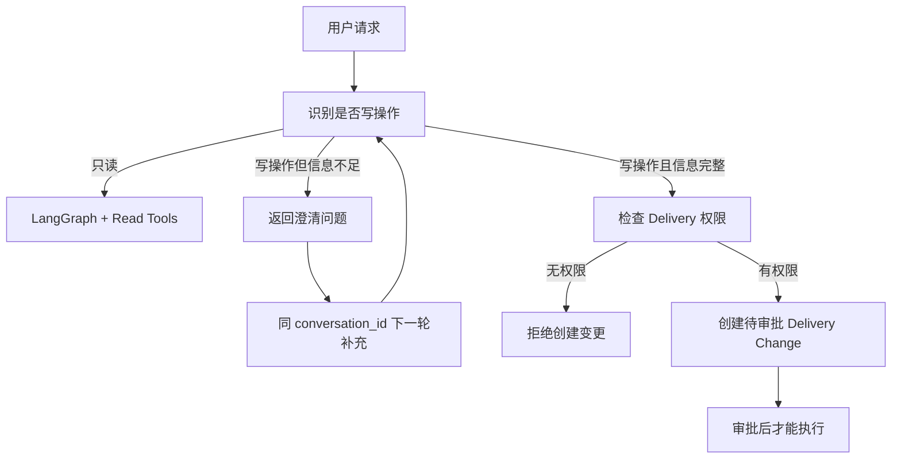

当前已支持的写操作变更类型：

- `update_waf_blacklist`
- `scale_service`
- `rollback_release`

## 轻量 CMDB / Service Catalog

当前版本已经实现轻量 Service Catalog，用来给 Agent 提供“服务地图”。它不是简单关键词表，而是结构化服务元数据 + 别名匹配 + 依赖关系。

代码层已经抽象成 `ServiceCatalogProvider`，默认使用 mock 数据，本地可直接运行；生产环境可以通过环境变量切换到 Backstage Catalog 或 HTTP CMDB：

```bash
# 默认本地模拟
SERVICE_CATALOG_SOURCE=mock

# 接 Backstage Catalog
SERVICE_CATALOG_SOURCE=backstage
BACKSTAGE_CATALOG_URL=https://backstage.example.com/api/catalog

# 接公司内部 CMDB
SERVICE_CATALOG_SOURCE=cmdb
CMDB_SERVICE_CATALOG_URL=https://cmdb.example.com/api/aiops/services
```

Provider 结构：

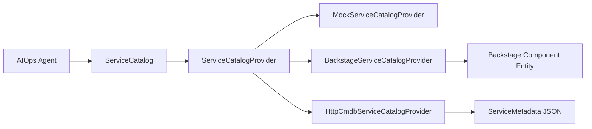

Service Catalog 记录：

```text
service id / name
aliases
owner / team
environment
cluster
namespace
logGroup
dashboard
approvalPolicy
runbooks
dependencies
permissions
```

查询工具：

```text
query_service_context
```

服务定位链路：

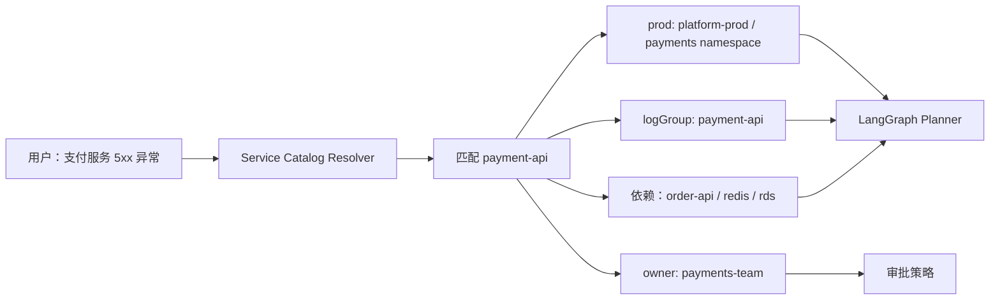

这样用户不需要准确说出 namespace、log group 或 dashboard。Agent 会先用服务地图定位上下文，再决定调用哪些工具协同分析。

## 连接本地大模型

本项目默认按 OpenAI-compatible 接口连接本地大模型。只要你的本地模型服务提供：

```text
POST /v1/chat/completions
```

就可以直接接入，例如 Ollama、vLLM、LM Studio、LocalAI 或公司内部网关。

环境变量示例：

```bash
MODEL_PROVIDER=local
LOCAL_MODEL_BASE_URL=http://127.0.0.1:11434
LOCAL_MODEL_NAME=qwen2.5
LOCAL_MODEL_API_KEY=
```

如果你的本地服务地址已经包含 `/v1`，这里不要重复写 `/v1`，代码会自动拼接 `/v1/chat/completions`。

调用关系：

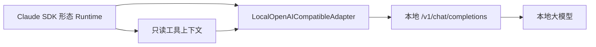

切换到 mock 模型：

```bash
MODEL_PROVIDER=mock
```

切换到 MiniMax：

```bash
MODEL_PROVIDER=minimax
MINIMAX_API_KEY=你的 MiniMax Key
MINIMAX_MODEL=MiniMax-M3
MINIMAX_BASE_URL=https://api.minimax.io
```

## AIOps 工具能力

所有工具都是只读工具，并返回统一结构化 JSON。

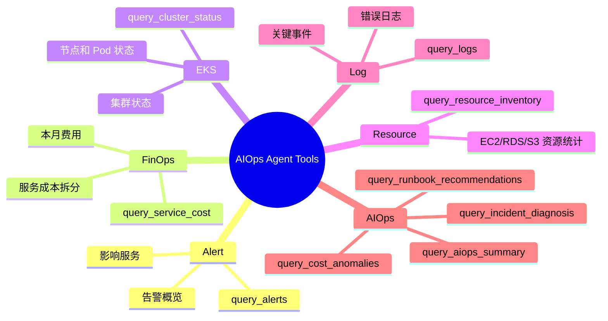

核心平台工具：

- `query_alerts`
- `query_service_cost`
- `query_cluster_status`
- `query_resource_inventory`
- `query_logs`

AIOps 关联分析工具：

- `query_incident_diagnosis`
- `query_cost_anomalies`
- `query_runbook_recommendations`
- `query_aiops_summary`

## 动态多功能联动分析

Agent 已经实现基于 LangGraph.js 的 `AnalysisPlanner`，不再只是一次性调用单个工具。它会先让本地 OpenAI-compatible 大模型基于工具描述生成结构化工具计划，然后由 LangGraph 校验、过滤越权/不存在的工具并执行；如果本地模型不可用或输出无效，会回退到规则计划。

异常分析默认链路：

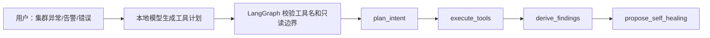

LangGraph 节点职责：

| 节点 | 作用 |
| --- | --- |
| `plan_intent` | 优先让本地大模型基于 Tool Manifest 识别用户意图并生成多阶段工具计划 |
| `execute_tools` | 按计划执行单工具或多工具协同分析 |
| `derive_findings` | 从工具证据中推导异常、根因和影响面 |
| `propose_self_healing` | 生成需要审批的自愈/交付建议 |

返回结果会包含：

```text
analysis_plan             多步骤分析计划
tool_calls                每一步调用过的工具和证据
findings                  Agent 推导出的发现和根因假设
self_healing_proposals    后续自愈/交付建议，必须审批后才能执行
```

每个 `analysis_plan` 步骤现在还会带规划可解释字段：

```json
{
  "phase": "correlate",
  "tools": ["query_cluster_status", "query_logs"],
  "reason": "用户描述服务异常，需要关联集群状态和日志。",
  "confidence": 0.84,
  "planner": "model",
  "signals": ["service:payment-api", "intent:incident", "mode:multi-tool"]
}
```

字段含义：

- `confidence`：工具规划置信度，表示“这一步工具选择是否充分”，不是根因结论置信度。
- `planner`：计划来源，`model` 表示本地模型生成，`rule` 表示规则兜底，`system` 表示系统安全补充。
- `signals`：服务命中、意图类型、多工具协作等可解释信号。

项目还新增了离线规划评测模块 `src/agent/planningEvaluation.ts`，用于把真实历史问题整理成评测集，检查 Agent 是否选中了预期工具。例如“支付服务 5xx 异常”必须覆盖服务目录、告警、日志、集群和根因诊断工具；“本月费用异常”必须覆盖费用、资源和成本异常工具。

自愈建议只生成计划，不会直接改生产环境。真正执行仍然要进入 `/api/delivery/changes` 审批和审计流程。

工具计划格式：

```json
{
  "steps": [
    {
      "phase": "correlate",
      "tools": ["query_cluster_status", "query_logs"],
      "reason": "用户描述服务异常，需要关联集群状态和日志。"
    }
  ]
}
```

本地模型只能选择已注册工具。不存在的工具、写操作或用户无权限工具会被后端过滤，不能直接执行。

内部验证路由是 `/api/tools/{tool_name}`。Backstage 前端正常只调用 `/api/agent/chat`。

## Backstage 集成方式

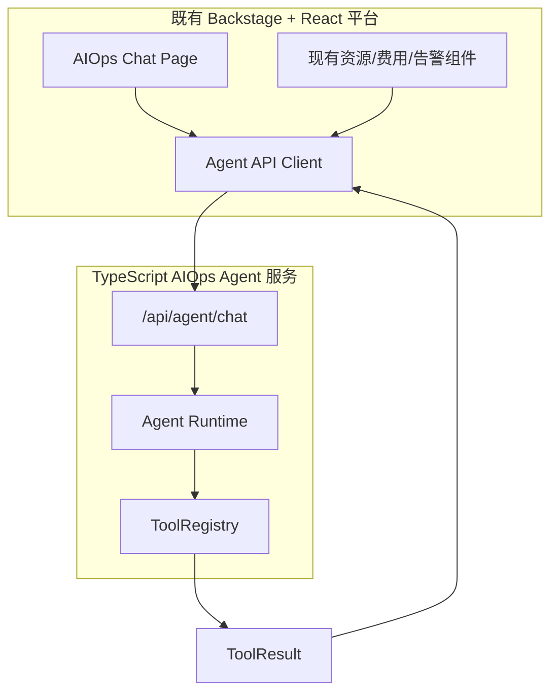

Backstage 插件建议渲染：

- `answer`：展示为 Agent 回复。
- `tool_calls`：展示为可展开证据面板。
- `result.summary`：展示为简短证据摘要。
- `result.data`：按领域渲染成表格、JSON、卡片或原有 AIOps 组件。

## 后续扩展方式

后续要把原 AIOps 平台能力或新能力接入 Agent，按下面流程即可：

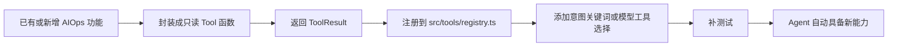

工具返回结构保持统一：

```ts
type ToolResult = {
  tool: string;
  category: "Alert" | "FinOps" | "EKS" | "Resource" | "Log" | "AIOps";
  readonly: true;
  summary: string;
  data: Record<string, unknown>;
};
```

这样旧功能、新功能都可以被 Agent 统一识别、调用、分析，Backstage 前端入口不需要变化。

## 后续交付与变更执行

当前版本已经实现了 Delivery Actions / Change Workflows 的基础代码。只读工具继续负责查询和分析；变更交付通过独立的 `/api/delivery/changes` 系列接口完成，默认是 mock 执行，不会改真实基础设施。

推荐分层：

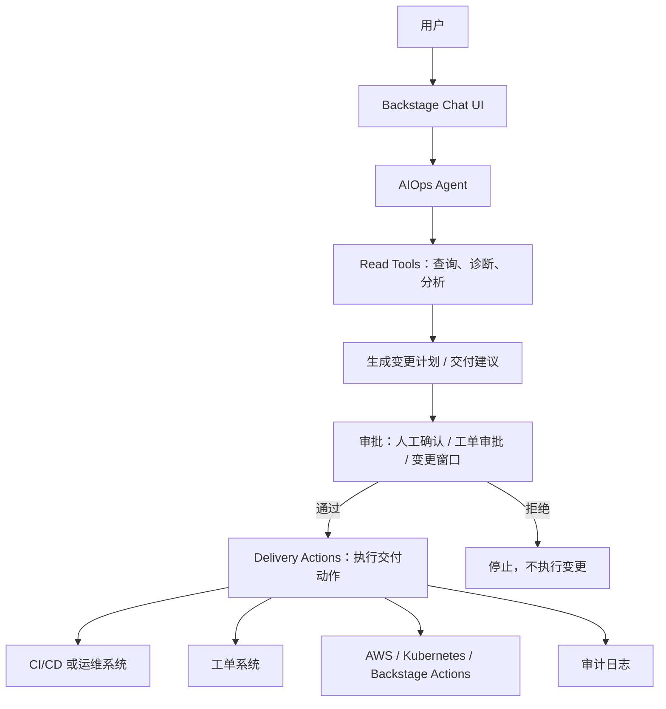

只读工具和交付动作的边界：

| 类型 | 作用 | 是否可改环境 | 示例 |
| --- | --- | --- | --- |
| Read Tools | 查询事实、诊断问题、生成证据 | 否 | 查资源、查费用、查日志、查告警、查集群状态 |
| Delivery Actions | 执行交付和变更 | 是，但必须审批 | 创建工单、触发流水线、执行回滚、扩容、发布配置 |
| Change Workflows | 串联审批、执行、校验、审计 | 是，但必须受控 | 生成变更计划、等待审批、执行、验证、记录审计 |

交付动作必须具备这些保护：

- 审批：任何写操作都必须先生成计划，再由人或审批系统确认。
- 权限：按用户、团队、环境、服务做 RBAC 控制。
- 审计：记录谁发起、谁审批、执行了什么、结果是什么。
- 幂等：每个交付动作必须有 `changeId` 或 `idempotencyKey`，避免重复执行。
- 分环境：生产环境默认更严格，至少需要审批和变更窗口。
- 可回滚：交付计划要包含验证方式和回滚策略。
- 可解释：Agent 必须展示执行前依据，包括用到的只读工具结果。

已实现的交付接口：

```text
POST /api/agent/chat              # 继续作为用户聊天入口
POST /api/delivery/changes        # 创建变更计划
GET  /api/delivery/changes/:id
POST /api/delivery/changes/:id/approve
POST /api/delivery/changes/:id/execute
POST /api/delivery/changes/:id/verify
POST /api/delivery/changes/:id/escalate
GET  /api/delivery/changes/:id/audit
```

当前交付闭环状态：

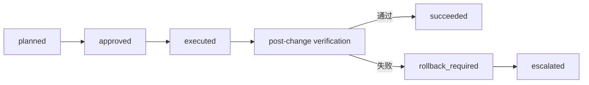

闭环行为：

- `execute` 只表示变更动作已执行，不直接代表业务恢复。
- `verify` 会执行变更后复查，当前为 mock verifier，后续可替换成真实告警、日志、集群、SLO 检查。
- 复查通过后状态进入 `succeeded`。
- 复查失败后状态进入 `rollback_required`，表示需要回滚或人工判断。
- `escalate` 用于把失败闭环升级给 SRE、服务 owner 或工单系统。

复查器已经拆成可替换的 checker pipeline：

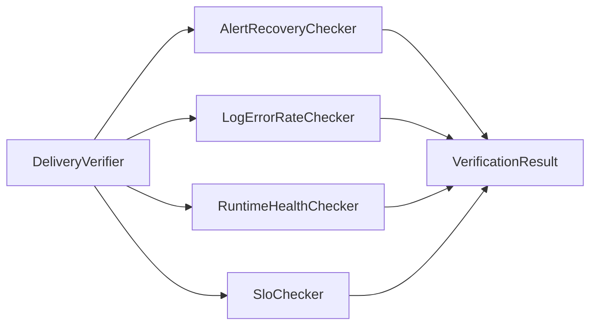

当前默认配置：

```bash
VERIFICATION_SOURCE=mock
```

生产替换方向：

- `AlertRecoveryChecker`：接 CloudWatch Alarm、Alertmanager 或现有告警平台。
- `LogErrorRateChecker`：接 CloudWatch Logs Insights、OpenSearch、Loki 或现有日志平台。
- `RuntimeHealthChecker`：接 EKS/Kubernetes 只读 API，检查 Deployment、Pod、HPA、Service 状态。
- `SloChecker`：接 Prometheus、Grafana 或 SLO 平台，检查错误率、延迟和 burn rate。

核心原则：

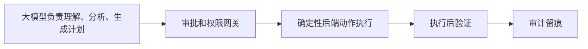

也就是说，Agent 可以推动交付，但不能绕过审批直接改生产环境。

创建变更计划示例：

```bash
curl -X POST http://127.0.0.1:8000/api/delivery/changes \
  -H "Content-Type: application/json" \
  -d '{
    "title":"扩容 platform-prod API",
    "summary":"基于告警、EKS pending pods 和日志错误生成的扩容建议",
    "environment":"prod",
    "requestedBy":"alice",
    "actions":[
      {
        "type":"scale_service",
        "target":"platform-prod/api",
        "parameters":{"replicas":6}
      }
    ],
    "evidence":["query_alerts","query_cluster_status","query_logs"],
    "idempotencyKey":"change-platform-prod-api-001",
    "rollbackPlan":"如果错误率未下降，恢复原副本数并升级给服务 owner"
  }'
```

## 只读安全边界

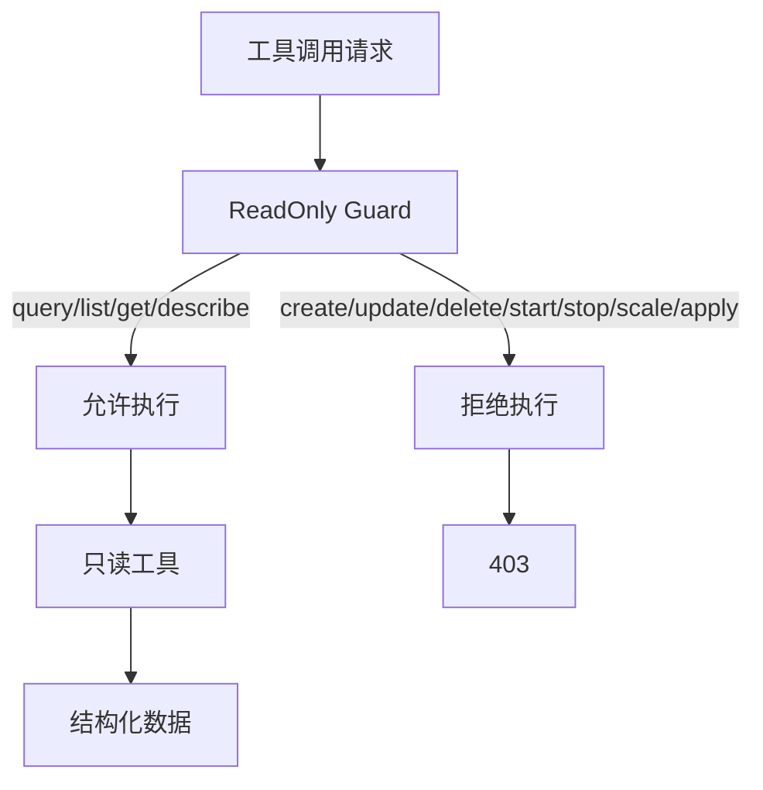

安全约束：

- 工具名必须以 `query_`、`list_`、`get_`、`describe_` 等只读前缀开头。
- `create_`、`update_`、`delete_`、`start_`、`stop_`、`scale_`、`apply_` 等变更类前缀会被拒绝。
- MiniMax 只接收后端整理好的只读上下文，不能绕过 `ToolRegistry` 直接操作 AWS。
- 当前 AWS 是模拟账号；后续真实 AWS 也应只接只读 IAM 权限。

## 替换为真实 AWS 查询

后续接真实 AWS 时：

1. 在 `src/integrations/aws/provider.ts` 实现 `AssumeRoleAwsProvider`。
2. 使用 STS AssumeRole 获取短期凭证。
3. IAM 权限保持只读。
4. 将 mock 工具数据替换成 AWS SDK 只读查询：
   - Alert：CloudWatch Alarm 或事件源。
   - FinOps：Cost Explorer。
   - EKS：EKS API 和 Kubernetes 只读 API。
   - Resource：Resource Groups Tagging API、Config 或各服务 Describe API。
   - Log：CloudWatch Logs 只读查询。
   - AIOps：继续在服务端做跨工具关联分析。
5. 保留 `src/tools/guard.ts` 的只读限制。

## 测试

```bash
npm run build
npm test
```
