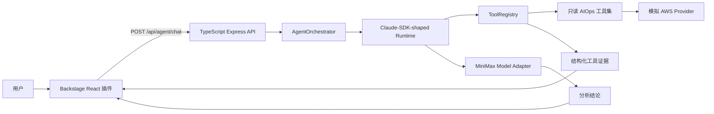
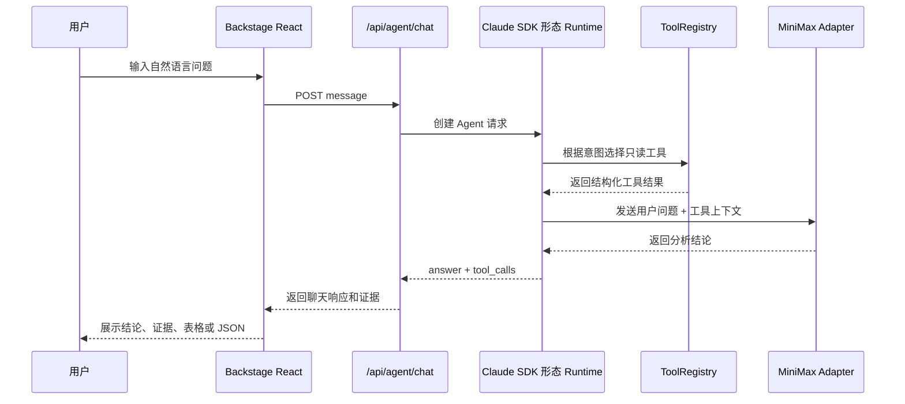
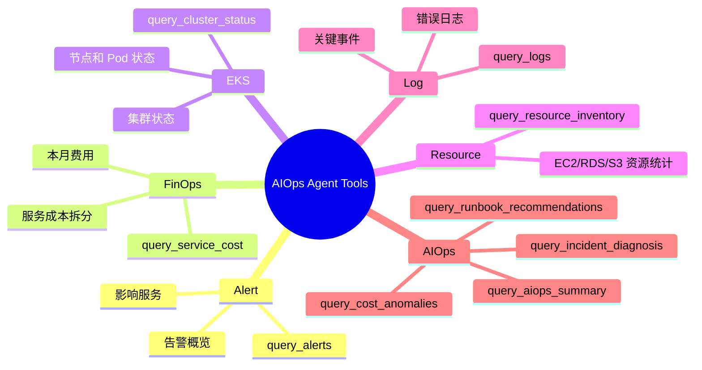
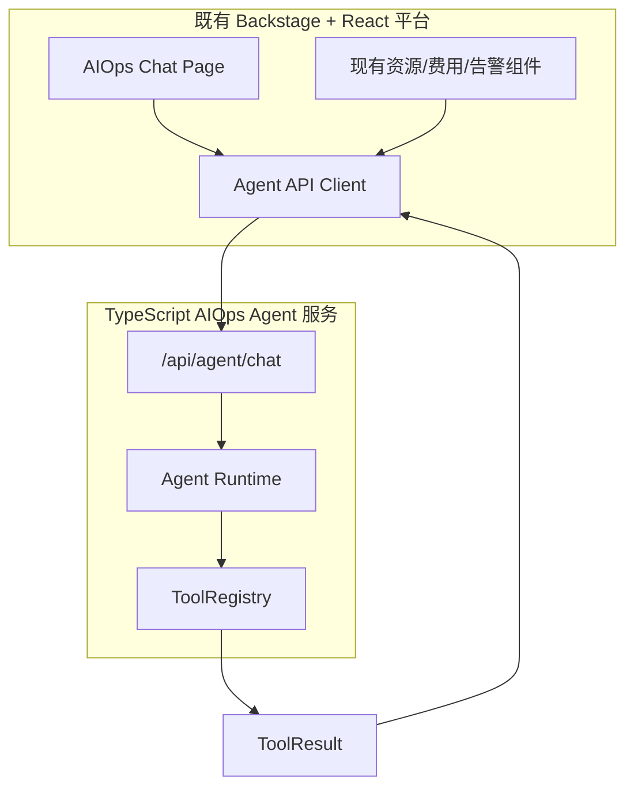
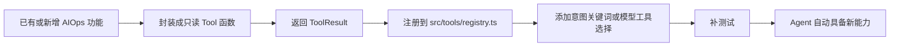
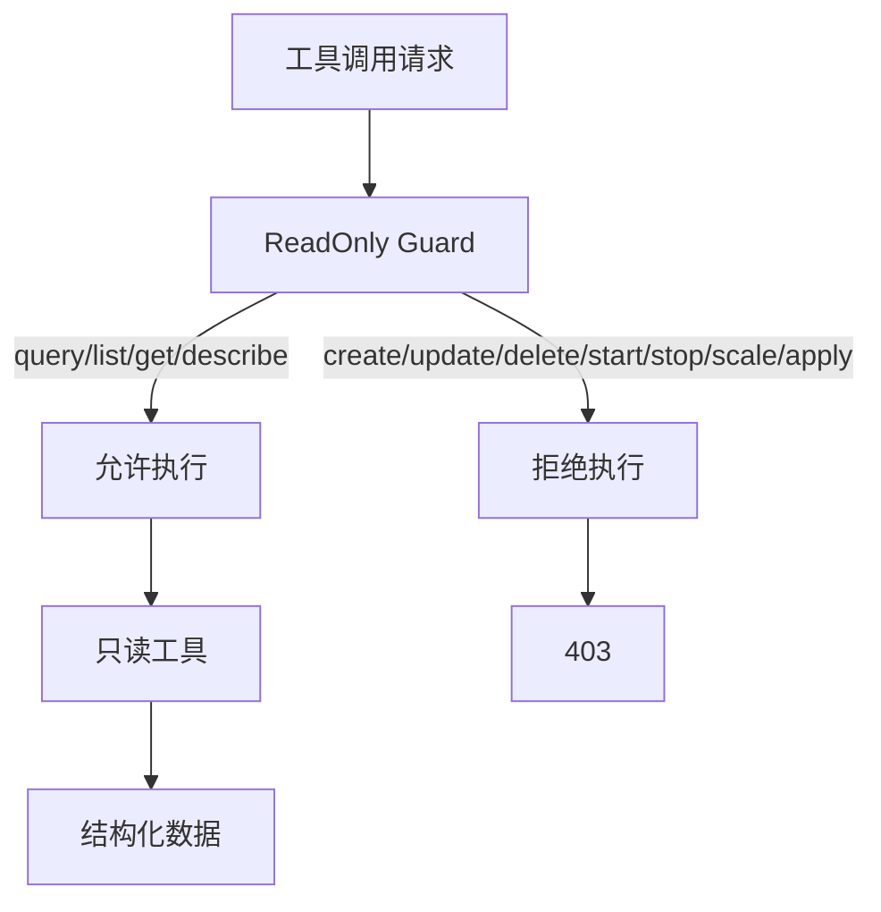

# AWS Platform AIOps Agent

这是一个面向 AWS 平台运维场景的只读 AIOps Agent。项目已经改造成 TypeScript 版本，目标是兼容既有的 Backstage + TypeScript + React AIOps 平台，让原平台能力和后续扩展能力可以持续接入 Agent。

前端稳定入口只有一个：

```text
POST /api/agent/chat
```

当前版本不需要真实 MiniMax Key，也不需要真实 AWS 账号即可本地运行。没有配置 `MINIMAX_API_KEY` 时，会使用 mock 大模型；AWS 账号由 `MockAwsProvider` 模拟。

## 总体架构



## 代码结构

```text
src/app/              Express 应用和 HTTP 路由
src/agent/            Claude SDK 形态运行时、Agent 编排、MiniMax 适配器
src/tools/            只读工具：AIOps、Alert、FinOps、EKS、Resource、Log
src/integrations/aws/ 模拟 AWS 账号 Provider，后续接 AssumeRole
src/schemas/          Zod 请求校验和 TypeScript 响应类型
src/tests/            API、工具、只读 Guard 测试
docs/                 架构和 Backstage 集成说明
```

## 运行方式

```bash
npm install
npm run dev
```

构建和生产方式运行：

```bash
npm run build
npm start
```

示例请求：

```bash
curl -X POST http://127.0.0.1:8000/api/agent/chat \
  -H "Content-Type: application/json" \
  -d '{"message":"查看本月费用、EKS 集群状态、日志、告警和 AIOps 总结"}'
```

## 环境变量

| 变量 | 是否必需 | 说明 |
| --- | --- | --- |
| `MINIMAX_API_KEY` | 否 | 配置后调用 MiniMax Chat Completions；不配置则使用 mock 模型。 |
| `MINIMAX_BASE_URL` | 否 | MiniMax API 地址，默认 `https://api.minimax.io`。 |
| `MINIMAX_MODEL` | 否 | MiniMax 模型名，默认 `MiniMax-M3`。 |
| `AWS_ROLE_ARN` | 否 | 后续真实 AWS AssumeRole 使用；当前 mock provider 不使用。 |
| `AWS_REGION` | 否 | AWS 区域，mock provider 默认 `us-east-1`。 |
| `PORT` | 否 | HTTP 端口，默认 `8000`。 |

## Agent 调用链路



## AIOps 工具能力

所有工具都是只读工具，并返回统一结构化 JSON。



核心平台工具：

- `query_alerts`
- `query_service_cost`
- `query_cluster_status`
- `query_resource_inventory`
- `query_logs`

AIOps 关联分析工具：

- `query_incident_diagnosis`
- `query_cost_anomalies`
- `query_runbook_recommendations`
- `query_aiops_summary`

内部验证路由是 `/api/tools/{tool_name}`。Backstage 前端正常只调用 `/api/agent/chat`。

## Backstage 集成方式



Backstage 插件建议渲染：

- `answer`：展示为 Agent 回复。
- `tool_calls`：展示为可展开证据面板。
- `result.summary`：展示为简短证据摘要。
- `result.data`：按领域渲染成表格、JSON、卡片或原有 AIOps 组件。

## 后续扩展方式

后续要把原 AIOps 平台能力或新能力接入 Agent，按下面流程即可：



工具返回结构保持统一：

```ts
type ToolResult = {
  tool: string;
  category: "Alert" | "FinOps" | "EKS" | "Resource" | "Log" | "AIOps";
  readonly: true;
  summary: string;
  data: Record<string, unknown>;
};
```

这样旧功能、新功能都可以被 Agent 统一识别、调用、分析，Backstage 前端入口不需要变化。

## 只读安全边界



安全约束：

- 工具名必须以 `query_`、`list_`、`get_`、`describe_` 等只读前缀开头。
- `create_`、`update_`、`delete_`、`start_`、`stop_`、`scale_`、`apply_` 等变更类前缀会被拒绝。
- MiniMax 只接收后端整理好的只读上下文，不能绕过 `ToolRegistry` 直接操作 AWS。
- 当前 AWS 是模拟账号；后续真实 AWS 也应只接只读 IAM 权限。

## 替换为真实 AWS 查询

后续接真实 AWS 时：

1. 在 `src/integrations/aws/provider.ts` 实现 `AssumeRoleAwsProvider`。
2. 使用 STS AssumeRole 获取短期凭证。
3. IAM 权限保持只读。
4. 将 mock 工具数据替换成 AWS SDK 只读查询：
   - Alert：CloudWatch Alarm 或事件源。
   - FinOps：Cost Explorer。
   - EKS：EKS API 和 Kubernetes 只读 API。
   - Resource：Resource Groups Tagging API、Config 或各服务 Describe API。
   - Log：CloudWatch Logs 只读查询。
   - AIOps：继续在服务端做跨工具关联分析。
5. 保留 `src/tools/guard.ts` 的只读限制。

## 测试

```bash
npm run build
npm test
```
